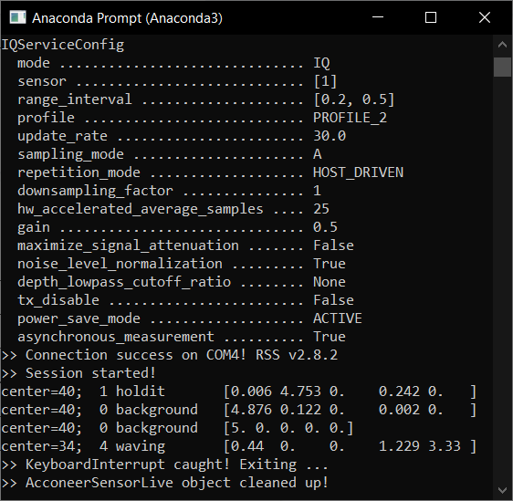
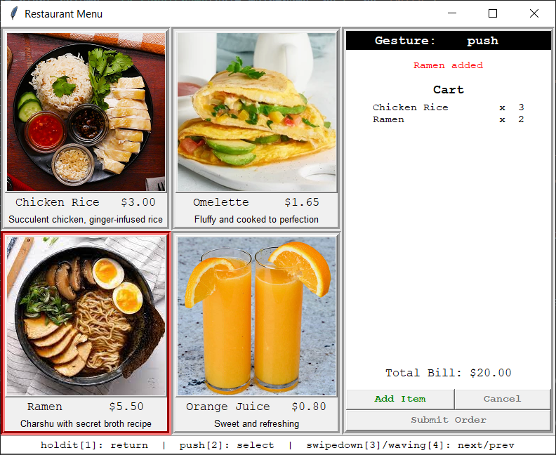

# Smart Touchless Control Radar

<br>

## This project is in fulfillment of NTU-EEE's EE3080 Design & Innovation Project.
- Project Title: E047 Smart Touchless control with Millimeter-Wave Radar Sensor and Artificial Intelligence
- Supervisor: Prof Lu Yilong
- Laboratory: Media Technology Lab (Loc: S2.2-B4-02)
- Group Members: Philip, Yi Wen (A), Wai Yeong (A), Davis (B), Jun De (B)

<br>

## Useful Links
- https://blogs.ntu.edu.sg/ee3080-2122s1-e047/
- https://ts.ntu.edu.sg/sites/intranet/cs/eee/UGProg/FTUGProg/dip/Pages/dipIntro.aspx
- https://acconeer-python-exploration.readthedocs.io/en/latest/index.html

<br>

## Folder Structure
- Folders with the prefix `acconeer` are sample/setup references files forked from [Acconeer's GitHub](https://github.com/acconeer).
- The main directory is `final-pipeline`, which contains all the finalised files used.
- Project admin-related files like **Project Charter** and **Project Report** are password protected for the time being.

<br>

## Running the Gesture Recognition Script
- Run `final-pipeline/final-realtime-hybrid.py`.
    
    

```
usage: final-realtime-hybrid.py [-h] [-rpi] [-kb]

DIP E047: Final Real-time Gesture Prediction

optional arguments:
  -h, --help   show this help message and exit
  -rpi, --rpi  Raspberry Pi mode to fix port
  -kb, --kb    Keyboard presses
```

<br>

## Running the Menu Application
- Run `final-pipeline/restaurant-menu.py` with the `-kb` flag on the previous script `final-pipeline/final-realtime-hybrid.py`.

    

<br>

## GUI for Gesture Extraction
- `final-pipeline/gesture_extractor_gui.py` is a Python script developed to automate the process of extracting gesture samples from a continous recording obtained from the GUI tool provided by Acconeer. This fixes the alignment issue faced when recording one sample at a time.
- The tool saves extracted samples in `.npz` format with the intention of a small file size. To read data from these new files, please use `np.load('filename-000.npz')['sample']`, where *filename* is a placeholder.
- For ease of running the tool, an alternative Windows executable file `final-pipeline/gesture_extractor_gui.exe` is available too.  
    
    