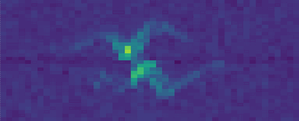
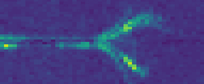

# Acconeer's speaker demo using deep learning

In this example, 2 sensors (XR112) are used to control music playback.
In the most basic version, a speaker is attached to a Raspberry Pi and the sensors are used to detect 5 different gestures, controlling the following actions:

* change song (Next/Previous), swipe from left to right or vice versa
* pause/resume playback, move hand down and up again over sensor
* volume down, keep hand closer than 20cm to sensor
* volume up, keep hand between 20cm and 36cm distance to sensor (the scanning range ends at 36cm!)

In the advanced version a 3rd sensor is added for motion activation of the gesture detection.
<br/><br/>
See a video of the demo on our Youtube Channel:

[](https://www.youtube.com/watch?v=bdTiTBzNvdQ)
<br/><br/>

## Included files
In this folder you can find all files required to setup the demo:

| File | Content |
| --- | --- |
| stand_alone_speaker.py | Actual demo (loads model, starts sensors, does predictions and performs actions) |
| model_data_speaker_sparse.npy | contains the model data, sensor settings and feature collection settings |
| acc_bstick_lib.py | a demo library controlling a [Blinkstick](https://www.blinkstick.com/products/blinkstick-strip) led strip (you may use any other led strip or none at all) |
| sensor_holder_and_lens_cover.stl |3D file for printing the sensor and led holder with a 3D printer |

<br/><br/>

## Requirements
You will need the following items:

* 2 [XR112 Sensors](https://www.digikey.se/product-detail/en/acconeer-ab/XR112/1891-1003-ND)
* 1 [XC112 Connector board](https://www.digikey.se/product-detail/en/acconeer-ab/XC112/1891-1004-ND/9356272)
* 1 [Raspberry Pi 3](https://www.raspberrypi.org/)
* 1 Speaker
* 1 cable connecting speaker to Raspberry Pi
* 1 [Led strip](https://www.blinkstick.com/products/blinkstick-strip) (optional)
* third XM112 for motion detection (optional)
<br/><br/>

## Setup instructions
In order to use our pre-trained model, it is important to have the correct spacing between the senors.
For that, print the [sensor holder](sensor_holder_and_lens_cover.stl) with any 3D printer and attach the sensors.
If you want to print the sensor cover as well, make sure to use a material that is transparent to 60GHz radiation, such PLA or ABS.
Attach the sensors to the XC112 board, left on 2, right on 4.
You can use any port, but make sure you add the correct port numbers in the stand_alone_speaker.py file.
If you want to use the presence function, attach the 3rd sensor to one of the remaining ports (default is 3).
Next, connect the speaker to the Raspberry Pi; the easiest method is using the 3.5mm audio output.
If available, attach the LED strip; we have chosen the [Blinkstick](https://www.blinkstick.com/products/blinkstick-strip) due to its USB interface.
If you want to use another LED strip, you will have to add your own library for controlling it.

<p align="center">
  
</p>

### Setup the Raspberry Pi:
1. Download your preferred OS. We recommend [Raspbian lite](https://www.raspberrypi.org/downloads/raspbian/), but any other version should work fine, too.
2. Follow the [installation](https://www.raspberrypi.org/documentation/installation/installing-images/README.md) guide. Make sure you can open an SSH connection to the Raspberry Pi and python3 and pip are installed!
3. Open an SSH connection to the Raspberry Pi, fetch the acconneer-exploration-tool repository and install the required packages. For details, check the instructions [here](https://github.com/acconeer/acconeer-python-exploration). We only install the requirements for the client functionality, i.e., not install any PyQt packages. At the time of this writing, TensorFlow 1.15.2 is not available for the Raspberry Pi. In that case install tensorflow-1.14.0.

```
sudo apt-get update
sudo apt-get upgrade
sudo apt-get install git
cd ~
git clone https://github.com/acconeer/acconeer-python-exploration.git
cd acconeer-python-exploration
python3 -m pip install -U --user setuptools wheel
python3 -m pip install -U --user -r requirements_client_only.txt
python3 -m pip install -U --user -r requirements_ml.txt
python3 -m pip install -U --user .
```
4. Fetch the examples repository
```
cd ~
git clone https://github.com/acconeer/acconeer-deep-learning-examples.git
```
5. Install the streaming server as described [here](https://acconeer-python-exploration.readthedocs.io/en/latest/evk_setup/raspberry.html).
6. Music handling is done via the open source Logitech Media Server (LMS) and client. Follow this [tutorial](https://www.hagensieker.com/wordpress/2018/06/12/302/) to install it on the Raspberry Pi; skip the Raspbian installation.
7. Install the python3 squeezebox package.
```
python3 -m pip install squeezebox-controller --user
```
8. Copy some music onto the Raspberry Pi. Make sure to copy the music to the folder you selected when you connected to the LMS web interface for the first time. Create a playlist of the music and store it in the folder for playlists for the LMS.
```
ls -1 *.mp3 > PATH_TO_YOUR_PLAYLIST_FOLDER/YOUR_PLAYLIST.m3u
```
9. Verify that LMS is working and you can play the above created playlist. You can find several apps for iOS and Android to control the LMS as well.
10. If you are using the [Blinkstick](https://www.blinkstick.com/products/blinkstick-strip), install the corresponding package via
```
python3 -m pip install BlinkStick --user
```

## Run the demo
Make sure the demo is configured according to your setup.
At the top of the [stand_alone_speaker.py](stand_alone_speaker.py) file, all important parameters are listed.
Check that the sensor numbers are correct and set USE_LEDS and USE_PRESENCE to true/false, depending on whether you intend to use it or not.
You can also change cool down times for the different operations of the demo.

```python
# Demo config:
SENSOR_SPEAKER = [2, 4]
USE_LEDS = True
PLAYLIST = "Oldies"
USE_PRESENCE = False
SENSOR_PRESENCE = [2]
UPDATE_RATE_PRESENCE = 80
PRESENCE_RANGE = [0.18, 2]
PRESENCE_ZONES = [.6, 1, 1.4, 1.8] # Switch to speaker mode at closest zone

# Demo behavior
VOL_COOL_DOWN = 5
SWIPE_COOL_DOWN = 200
VOL_SKIPS = 10
SWIPEMODE = [0, 1, 6, 7]
SWIPE_COLOR = [100, 0, 100]
VOL_STEP = 100/16
PLAY_PAUSE_COOL_DOWN = 50
IDLE_COUNT = 30 * 60 # 30 seconds to switch from speaker to presence mode
PRINT_PREDICTIONS = True
```

If left and right swipe are mixed up in the detection, swap the sensor numbers or the sensor cables.
You may use the same sensor(s) for the presence detection as you use for the gesture detection.
If you don't have any LEDs, set USE_LEDS to False.
If you use your own led interface, make sure to update the LED library and import!

If everything is setup correctly, you should first start the streaming server and then start the demo in another terminal via

```
cd ~/acconeer-acconeer-deep-learning-examples/demo_speaker
python3 stand_alone_speaker.py
```

Note, that the feature and keras-processing files are not part of the Acconeer library and need to be correctly added to the Python path.
If you have chosen different folders for the examples and Acconeer library, please update accordingly at the top of the [stand_alone_speaker.py](stand_alone_speaker.py) file.

```python
# Path to acconeer-python-exploration folder relative to this file
sys.path.append(
    os.path.join(os.path.dirname(__file__),
    "../../acconeer-python-exploration")
)
# Path to ml processing files relative to this file
sys.path.append(
    os.path.join(os.path.dirname(__file__),
    "../../acconeer-python-exploration/gui/ml")
)
```

## Training (optional)
If you want to train the model yourself, make sure you have the Python Exploration Tool and the additional [requirements_ml.txt](https://github.com/acconeer/acconeer-python-exploration/blob/master/requirements_ml.txt) installed.
It is important that you install the correct versions of Keras and TensorFlow.
TensorFlow 2.0 support will be added in the future.
For details on how to use our deep learning interface, please read the [documentation](https://acconeer-python-exploration.readthedocs.io/en/latest/deep_learning/introduction.html).

```
python3 gui\main.py -ml
```

First, load the model from the demo speaker folder with the GUI via the *Load model* button in the bottom middle area.
This will load the model layers, feature definitions and sensor settings that were used to create this demo.
At this point, the GUI will not allow you to change any settings!
Remove the model, by clicking the *Remove model* button.
This will unlock all settings, so you can change them and train your own model.
Advance to the [Select Features](https://acconeer-python-exploration.readthedocs.io/en/latest/deep_learning/work_steps/select_features.html) tab to inspect the feature settings.

<p align="center">
  
</p>

### Sensor settings
This model uses the [Sparse mode](https://acconeer-python-exploration.readthedocs.io/en/latest/services/sparse.html).
The scanning start range should not be less than 12cm and with profile 2, to avoid saturation of the first distance index.
With a higher or lower profile you might have to increase or decrease the start range, respectively.
For this demo, we scan between 12cm and 36cm; you can increase the stop range, but keep in mind that the SNR drops the further away you go.
The sensor is run in Sampling mode A, with an update rate of 60Hz, a sweep rate of 4500Hz and 64 sweeps per frame.
The gain is set to 0.5 and 60 HWAAS.
Unless you want to add other gestures, we recommend not changing these settings for this demo.

### Feature settings
The basic idea for this demo is to perform an FFT over each frame (consisting of 64 sweeps), and collapsing the FFT along the distance axis.
48 of these collapesed FFT's are merged into a single 2D array for each sensor and stitched together vertically.

```python
    sweep = arr[:, start_idx:stop_idx, 0]

    hanning = np.hanning(point_repeats)[:, np.newaxis]
    doppler = np.fft.rfft(hanning * (sweep - np.mean(sweep, axis=0, keepdims=True)), axis=0)
    doppler = abs(doppler)
    fft_psd = np.mean(doppler, axis=1) / 10000

    freq_bins = fft_psd.shape[0]
    freq_cutoff = int(high_pass * freq_bins)
    freq_cutoff_flipped = int((1.0 - high_pass) * freq_bins)

    if self.fft is None:
        self.fft = np.zeros((num_sensors, freq_bins, win_len))
    if self.noise_floor is None:
        self.noise_floor = np.full(num_sensors, np.inf)

    threshold = 1.0
    m = np.mean(fft_psd) * threshold
    if m < self.noise_floor[sensor_idx] and m > 1E-8:
        self.noise_floor[sensor_idx] = m

    fft_psd /= self.noise_floor[sensor_idx]
    self.fft[sensor_idx, :, :] = np.roll(self.fft[sensor_idx, :, :], 1, axis=1)
```

In order to emphasize correlation of low frequencies between the FFT's of both sensors, we flip the 2D array of one sensor before stitching, so low frequencies are centered in the resulting stitched array.
In the feature configuration area, you can click *Test extraction* (provided you are connected to a streaming server) and un/check the *Flip* option to see the effect of the flipping.

### Labels
The model uses the following labels

| Label | Gesture | Function | Example |
| --- | --- | --- | --- |
| up_down | Hand moves down to sensor (entering the detection area) and up again (leaving the detection area) | Play and pause |  |
| to_left | Hand moves from right to left (entering and leaving the detection area) | Previous song |  |
| to_right | Hand moves from right to left (entering and leaving the detection area) | Previous song |  |
| down | Hand moves towards sensor (entering the detection area) and stays in the scanning range | Initiate volume change |  |
|volume | Hand is steady in detection area (different heights within scanning range) | Increase/lower volume |  |

You may add more gesture, but keep in mind that

* the gestures should be different enough, so the model can distinguish between them
* the *Sparse mode* is great for analyzing frequencies of hand gestures, but has very limited distance resolution

### Collecting data
For collecting data, we use the collection mode [Feature detections](https://acconeer-python-exploration.readthedocs.io/en/latest/deep_learning/work_steps/feature_collection.html#auto-detection) with a threshold of 1.2 and an offset of 5.
Adjust the threshold and offset if the detection is not working for your setup.

When collecting data for the *volume* label, change the collection mode to continuous; auto-trigger will not work well, since your hand will be in the detection volume at all times.


In the actual demo, we use the *Presence detection* to trigger feature collection.
This reduces load on the Raspberry Pi and only predicts once, when presence is detected.

In the [Feature Extraction](https://acconeer-python-exploration.readthedocs.io/en/latest/deep_learning/work_steps/feature_collection.html#) tab of the GUI, you can set the label you want to collect data for.
Click *Start scan* and perform the corresponding gesture.
Except for the *volume* label, start the gesture by entering the detection area (given by the scan range) and leave it immediately afterwards.
For each iteration, the GUI will collect a bunch of feature frames, provided the collection mode settings are set properly and label each feature frame for you.
After clicking *Stop scan*, make sure to save the data to a session file.
Every time you click *Start scan*, all sweep and feature data is erased!

We recommend collecting at least 500 feature frames for each label and if possible, collect data with several different persons performing each gesture.
This will greatly improve prediction performance between different people using the model.

The model provided here was trained with 35000 feature frames collected with 5 different persons in less then 4h.

### Model training
Provided you loaded the model in this folder with the GUI, you should have the model layers as used for this project in the [Model parameters](https://acconeer-python-exploration.readthedocs.io/en/latest/deep_learning/work_steps/model_configuration.html) tab.
You may change the layer structure and experiment with different settings.
Follow the [instructions](https://acconeer-python-exploration.readthedocs.io/en/latest/deep_learning/work_steps/model_training.html) on how to train the model with your own data.

Once you have successfully trained a new model, you can replace our model data file with yours and run the speaker demo with your own trained model.
